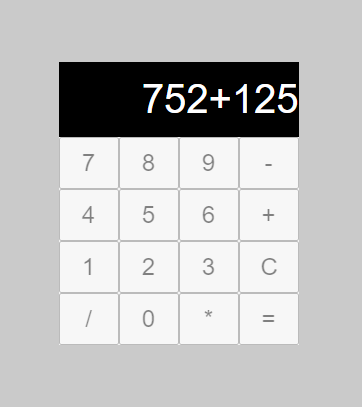

# Cálculadora com ReactJS :calling:

Projeto de calculadora criada com base na biblioteca do ReactJS para o desafio do Bootcamp React Developer PRO da Dio.

Utilizado Styled Components como biblioteca auxiliar para estilização da calculadora.

